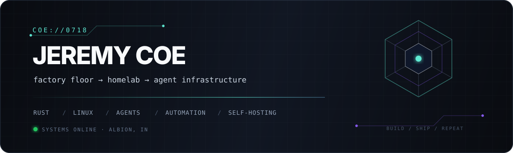
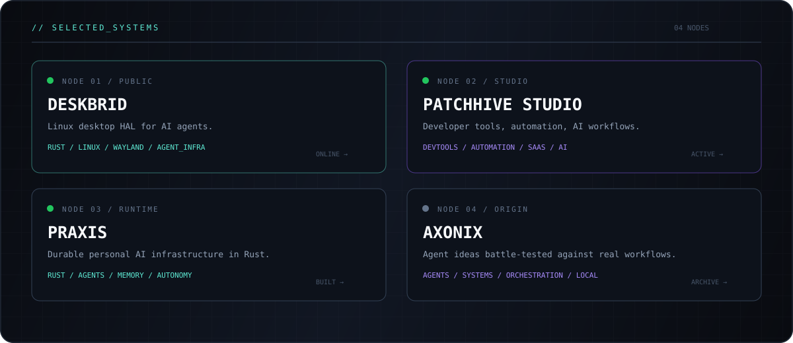
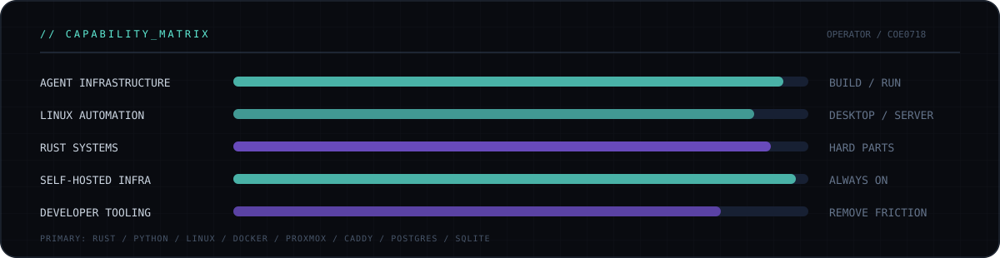
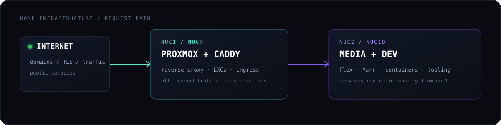
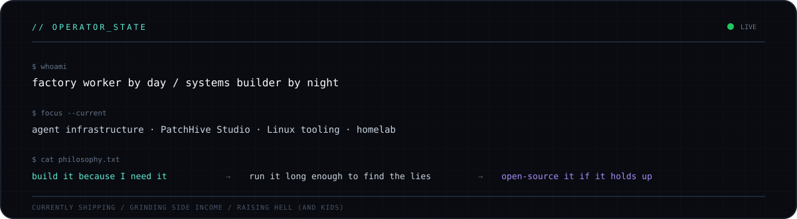
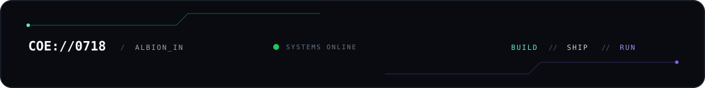

  <strong>I build systems I actually use.</strong> 
  Agent infrastructure · Linux automation · developer tooling · a frankly unreasonable homelab

<code>I DON'T BUILD DEMOS // I BUILD TOOLS I ACTUALLY RUN // THEN OPEN-SOURCE THE ONES THAT HOLD UP</code>

 

  <a href="https://github.com/coe0718/deskbrid"><code>01 / DESKBRID ↗</code></a>&nbsp;&nbsp;·&nbsp;&nbsp;
  <a href="https://github.com/patchhive"><code>02 / PATCHHIVE ↗</code></a>&nbsp;&nbsp;·&nbsp;&nbsp;
  <a href="https://github.com/coe0718/praxis"><code>03 / PRAXIS ↗</code></a>&nbsp;&nbsp;·&nbsp;&nbsp;
  <a href="https://github.com/coe0718/axonix"><code>04 / AXONIX ↗</code></a>

 

 

 

  <a href="https://github.com/patchhive"><code>STUDIO / GITHUB ↗</code></a>&nbsp;&nbsp;·&nbsp;&nbsp;
  <a href="https://patchhive.dev"><code>STUDIO / WEB ↗</code></a>&nbsp;&nbsp;·&nbsp;&nbsp;
  <a href="https://x.com/iamunk20"><code>SIGNAL / X ↗</code></a>&nbsp;&nbsp;·&nbsp;&nbsp;
  <a href="mailto:coe0718@icloud.com"><code>CONTACT / EMAIL ↗</code></a>

 

